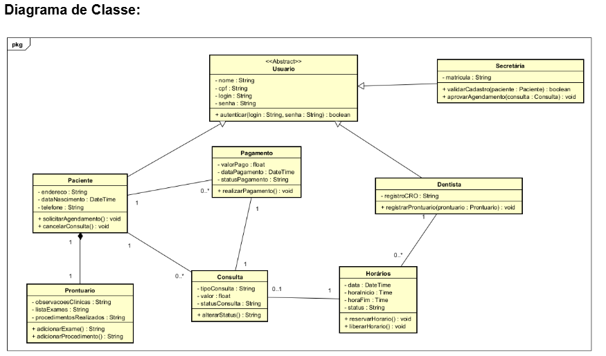

# Sistema de Gestão de Clínicas Odontológicas - API Restful

**Status do Projeto:** Finalizado (Versão 1.0)

## Visão Geral
Este repositório contém o back-end completo do Sistema de Gestão de Clínicas Odontológicas. Desenvolvido com **TypeScript** e **Node.js**, o sistema foi projetado para assegurar as regras de negócio centrais exigidas por profissionais de saúde (Dentistas, Secretárias e Pacientes), gerenciando fluxos críticos como Prontuários, Consultas, Horários e Pagamentos.

A arquitetura do projeto segue os preceitos rigorosos da **Clean Architecture** (Arquitetura Limpa) em conjunto com princípios **SOLID** e tipagem estrita (Zero `any`), almejando alto isolamento, segurança cibernética e manutenção facilitada.

---

## Arquitetura de Software e Design Patterns

O sistema foi estruturado para ser totalmente à prova de frameworks, separando as regras de negócio das tecnologias web.



1. **Domain (O Coração):** Entidades puras em POO (`Paciente`, `Consulta`, `Prontuario`).
2. **Application (Casos de Uso):** A orquestração do sistema (`SolicitarConsulta`, `GerenciarProntuario`).
3. **Infrastructure (Frameworks & Web):** Roteadores Express, Middlewares de Tratamento de Erro e Banco de Dados (In-Memory).

### Padrões GoF Utilizados:
* **Factory Method (`ConsultaFactory`):** Centralização da instanciação de especializações abstratas (Avaliatoria vs Cirúrgica), injetando variações de regras financeiras sem quebrar contratos da entidade base.
* **Proxy Pattern / RBAC (Role-Based Access Control):** Separação estrita do Controle de Acesso e Regras de Permissões baseada em Polimorfismo. Interceptadores e middlewares validam se o Paciente/Dentista possui direitos autorais (Ex: `instanceof Dentista`) para executar as requisições.
* **Repository Pattern:** Desacoplamento do Banco de Dados através de Interfaces. Atualmente usando injeção de dependência "In-Memory" para aprovação de protótipo acadêmico instantâneo.

---

## Funcionalidades e Regras de Negócio (RN)
* **RN09 - Privacidade:** Pacientes só podem ver ou manipular seus próprios dados e agendamentos.
* **RN11 - Sigilo Médico:** Dentistas só podem escrever exames e manipular o Prontuário de um paciente se houver comprovação no sistema de que o dentista já atendeu este paciente no passado.
* **Segurança Financeira:** O valor das consultas não é trafegado pelo cliente web (evitando fraudes de injeção JSON), sendo orquestrado puramente no Back-end com base no Tipo de Consulta.

---

## Tecnologias Utilizadas
* **Node.js** com **Express.js** (API RESTful)
* **TypeScript** (Tipagem forte com `npm run typecheck`)
* **Swagger / OpenAPI 3.0** (Documentação automatizada via JSDoc)
* **ESLint** (Linter configurado com sistema 100% Type-Safe)

---

## Como Executar o Projeto Localmente

### 1. Pré-Requisitos
Certifique-se de ter o **Node.js** (v18+) instalado na sua máquina.

### 2. Passo a Passo
Clone este repositório e instale as dependências:
```bash
git clone https://github.com/HeitorRangel/sistema-clinico-poo.git
cd sistema-clinico-poo
npm install
```

Para iniciar o servidor com *hot-reload* (ambiente de desenvolvimento):
```bash
npm run dev
```
> O terminal exibirá a porta onde a API está rodando, por padrão: `http://localhost:8080/api/health`

### 3. Validação de Linter e Tipagem (Qualidade de Código)
O projeto foi blindado semanticamente. Para auditar os tipos e a estética de código, utilize:
```bash
npm run typecheck
npm run lint
```

---

## Documentação da API (Swagger)

A API possui documentação interativa gerada automaticamente.
Com o servidor rodando (`npm run dev`), acesse o seu navegador na seguinte URL:

**Acesso ao Swagger UI:** `http://localhost:8080/api-docs`

### Testando com Contas Mocks (In-Memory)
Ao rodar a API, o banco de dados em memória criará as seguintes contas automáticas para você testar no endpoint `/api/auth/login`:

- **Paciente:** CPF `11122233344` | Senha `senha123`
- **Secretária:** CPF `00000000000` | Senha `admin123`
- **Dentista:** CPF `99988877766` | Senha `dent123`

Após fazer o login no Swagger, copie o `token` gerado, clique no botão **"Authorize"** no topo da página e cole-o lá para destravar as rotas protegidas!
